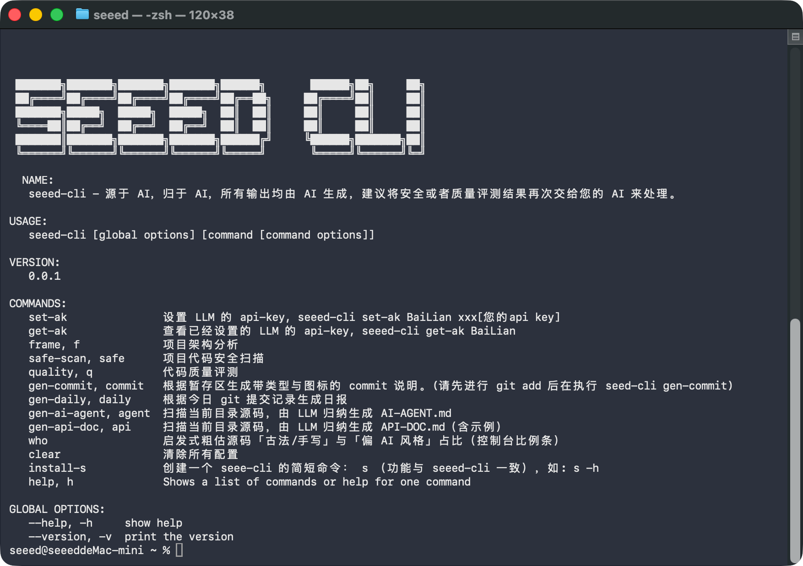
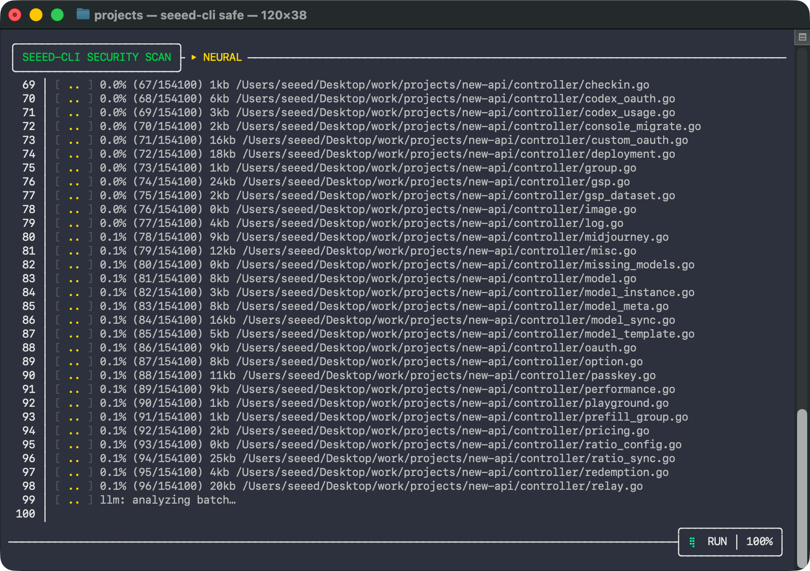
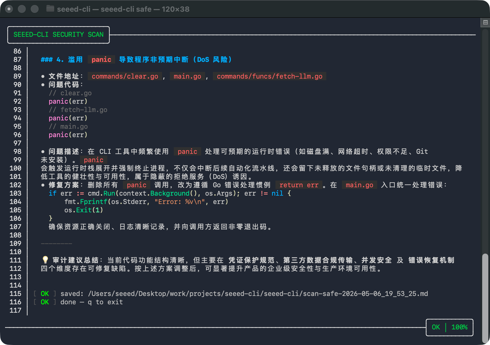
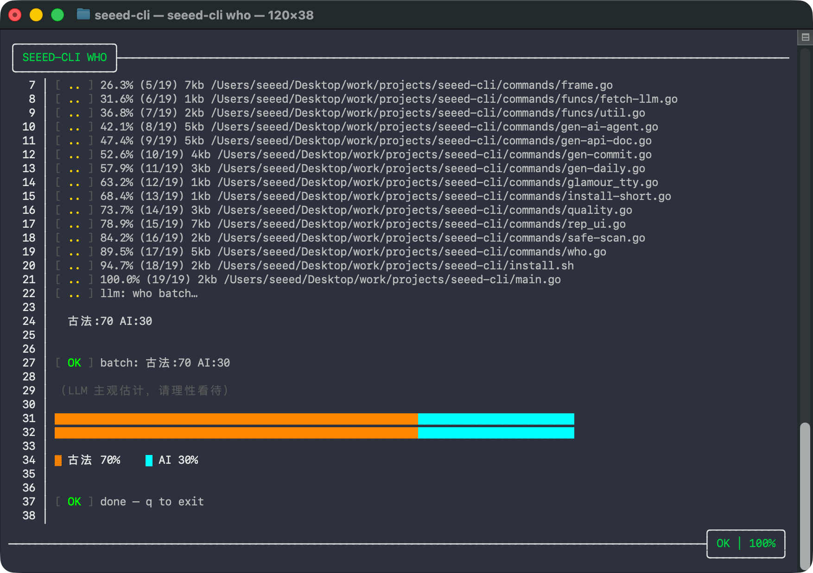

# 程序员的 AI 小伙伴 - seeed-cli

 

## 是什么

`seeed-cli` 在项目里统一调度 AI：把任务写成命令，复用同一套上下文，少做「每次从头讲一遍」的重复沟通。

安全扫描、质量检查、架构梳理、面向 AI 的说明、日报与提交说明、接口文档等，尽量一条链路走完。


> 基于AI的CLI工具: seeed-cli ，围绕项目开发时常见场景提供免自行驱动AI方案

## 功能/命令

| #  | 功能                                                  | 命令             | 完成 |
|----|-------------------------------------------------------|------------------|------|
| 0  | 将 seeed-cli 命令缩短为 s ，这样打命令更快             | `s install-s`    | ✓    |
| 1  | 项目安全扫描                                          | `s safe-scan`    | ✓    |
| 2  | 项目代码质量检查                                      | `s quality`      | ✓    |
| 3  | 项目架构分析                                          | `s frame`        | ✓    |
| 4  | 项目说明生成(针对AI)，作为 AI 修改本项目的说明书       | `s gen-ai-agent` | ✓    |
| 5  | 根据提交历史生成日报                                  | `s gen-daily`    | ✓    |
| 5  | 根据修改文件生成提交的 commit 说明(git commit 的描述) | `s gen-commit`   | ✓    |
| 6  | 接口文档生成                                          | `s gen-api-doc`  | ✓    |
| 7  | 代码出处分析                                          | `s who`          | ✓    |
| 8  | 多端兼容(windows、linux、macos)                         | —                | ✓    |
| 9  | AI skills/rules/workflows 扫描 + 评分 + 缺口分析      | `s skills-scan`  | ✓    |
| 10 | 跨工具 skills 同步（生成对应 SKILL.md 文件包）          | `s skills-sync`  | ✓    |
| 11 | 联网拉取高星 skill（内嵌 Top-50 索引）                  | `s skills-pull`  | ✓    |
| 12 | 登录持久化用户数据（微信登录、手机号码登录、github 登录） | `s login`        | x    |
| 13 | 炫酷 ai 聊天                                          | —                | x    |
| x  | 等你来...                                             | —                | -    |


## 安装

``` sh 
curl -fsSL https://raw.githubusercontent.com/wangzongming/seeed-cli/main/install.sh | bash
```
  
## API Key 配置

支持三个 LLM 平台：**BaiLian**（百炼）、**DeepSeek**、**GPT**（OpenAI）。

默认使用 BaiLian，可通过修改 `~/.seeed-cli/config.toml` 中的 `default_provider` 切换。

### 设置 API Key

``` sh
# 百炼
seeed-cli set-ak BaiLian xxx
# DeepSeek
seeed-cli set-ak DeepSeek sk-xxx
# OpenAI GPT
seeed-cli set-ak GPT sk-xxx
```

### 查看已设置的 Key

``` sh
seeed-cli get-ak BaiLian
seeed-cli get-ak DeepSeek
seeed-cli get-ak GPT
```

### 各平台默认模型

| Provider  | 默认模型          | Base URL                                              |
| --------- | ----------------- | ----------------------------------------------------- |
| BaiLian   | qwen3.6-flash     | `https://dashscope.aliyuncs.com/compatible-mode/v1`   |
| DeepSeek  | deepseek-v4-pro   | `https://api.deepseek.com/v1`                         |
| GPT       | gpt-4o            | `https://api.openai.com/v1`                           |

模型可在 `~/.seeed-cli/config.toml` 中按 provider 单独配置。

### 百炼 AK 获取教程

1. 打开 https://bailian.console.aliyun.com/cn-beijing?tab=model#/api-key 如果没有注册就注册登录
2. 点击右上角 创建 API Key
3. 复制您的 api key 并且执行 `seeed-cli set-ak BaiLian xxx(替换为您的ak)`

ps：注意账户不能欠费，欠费账号无法调用大模型。

## 新项目上手 Skill

内置了一个 Claude Code 技能，确保接触陌生项目时**先分析、再修改**。

### 安装（本项目内）

项目 `.claude/skills/seeed-cli-onboard-skill/` 已包含该 skill，拉取项目后自动生效。

### 使用

```
/seeed-cli-onboard 分析这个项目
```

### 工作流程

1. 检查 `seeed-cli` 及 API Key 是否就绪
2. `seeed-cli frame` — 架构分析（技术栈、模块边界、Mermaid 图）
3. `seeed-cli gen-ai-agent` — 生成 AI 协作约束文件 `AI-AGENT.md`
4. (按需) `seeed-cli safe-scan` / `quality` — 安全/质量扫描
5. 读取所有分析产物后，再按 `AI-AGENT.md` 约束进行代码修改

### 跨项目使用

``` sh
cp -r .claude/skills/seeed-cli-onboard-skill ~/.claude/skills/
```

## 开发环境

``` shell
go mod tidy

# 本地安装测试
make install
```

## 赞助商


- **seeed** - https://www.seeedstudio.com/

## 预览





## 命令使用说明

### set-ak

设置 LLM 的 api-key。

```sh
seeed-cli set-ak BaiLian <api-key>
```

### get-ak

查看已设置的 LLM api-key。

```sh
seeed-cli get-ak BaiLian
```

### frame / f

项目架构分析。

```sh
seeed-cli frame
seeed-cli f
```

### safe-scan / safe

项目代码安全扫描。

```sh
seeed-cli safe-scan
seeed-cli safe
```

### quality / q

代码质量评测。

```sh
seeed-cli quality
seeed-cli q
```

### gen-commit / commit

根据暂存区生成 commit 说明，执行前先 `git add`。

```sh
seeed-cli gen-commit
seeed-cli commit
```

### gen-daily / daily

根据今日 git 提交记录生成日报。

```sh
seeed-cli gen-daily
seeed-cli daily
```

### gen-ai-agent / agent

扫描当前目录源码，生成 `AI-AGENT.md`。

```sh
seeed-cli gen-ai-agent
seeed-cli agent
```

### gen-api-doc / api

扫描当前目录源码，生成 `API-DOC.md`。

```sh
seeed-cli gen-api-doc
seeed-cli api
```

### who

粗估源码「古法/手写」与「偏 AI 风格」占比。

```sh
seeed-cli who
```

### skills-scan / skills / sk

扫描并分析 AI 工具 skills、rules、workflows。

```sh
seeed-cli skills-scan
seeed-cli skills
seeed-cli sk
```

### skills-sync / sync

跨工具同步本地 skills。

```sh
seeed-cli skills-sync
seeed-cli sync
seeed-cli skills-sync --target claude --skills deploy-staging,api-review --overwrite -y
```

参数：

| 参数           | 说明                                            |
|----------------|-------------------------------------------------|
| `--target`     | 目标工具：`cursor`、`claude`、`windsurf`、`augment` |
| `--skills`     | 逗号分隔的源 skill 名，缺省进入交互式多选        |
| `--overwrite`  | 目标文件已存在时覆盖                            |
| `--yes` / `-y` | 跳过确认提示                                    |

### skills-pull / pull

联网拉取高星 skill，并安装到目标工具目录。

```sh
seeed-cli skills-pull
seeed-cli pull
seeed-cli pull --list
seeed-cli pull --search pdf --list
seeed-cli pull --ids anthropics/pdf,anthropics/docx --target claude -y --overwrite
```

参数：

| 参数            | 说明                                            |
|-----------------|-------------------------------------------------|
| `--search`      | 在 id、name、description、tags 中模糊过滤          |
| `--ids`         | 逗号分隔的 skill id 或 name，缺省进入交互式多选  |
| `--target`      | 目标工具：`cursor`、`claude`、`windsurf`、`augment` |
| `--list` / `-l` | 只列出当前匹配的 skill 索引，不下载              |
| `--overwrite`   | 目标文件已存在时覆盖                            |
| `--yes` / `-y`  | 跳过确认提示                                    |

### clear

清除所有配置。

```sh
seeed-cli clear
```

### install-s

创建简短命令 `s`。

```sh
seeed-cli install-s
s -h
```
